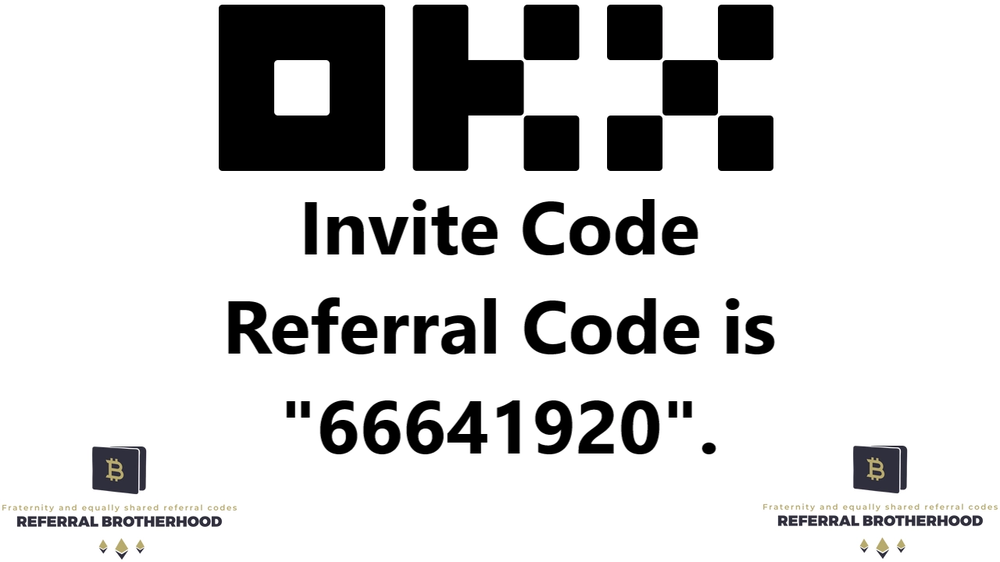

# OKX Referral Code (October 2025): Get 30% Trading Fee Discount + Mystery Box

Looking for a real deal on OKX trading fees? Most referral codes floating around only benefit the person sharing them—you get nothing. Here's what actually works: use code **47044926** when signing up, and you'll pocket a 30% fee reduction split as 15% instant discount plus 15% cashback in crypto. Plus, there's a mystery box reward waiting. No tricks, no fake testimonials—just straightforward savings on every trade you make.

---

## The Actual 30% Discount Breakdown

Here's how most referral programs quietly screw you over: the person sharing the code gets the lion's share, you get table scraps. 

With code **47044926**, it's different. The 30% commission split works like this:
- **15% goes to you as a direct trading fee discount**
- **15% comes back to you as cashback in coins**

So when you're trading, you're not just saving money upfront—you're earning crypto back on every transaction. It's like getting paid to trade, which is... well, exactly what it is.

When you hit the registration page, look for the field that says "Referral code (optional)." Type in **47044926**. The 30% rate kicks in immediately, plus you'll unlock a mystery box reward. No waiting periods, no hidden conditions.

## Setting Up Your OKX Account (Takes About 3 Minutes)

**Step 1: Hit the Registration Link**

👉 [Claim your 30% fee discount and mystery box here](https://www.okx.com/join/47044926)

After clicking, double-check the referral code field shows **47044926**. Sometimes browsers auto-fill weird stuff, so verify it's correct before moving forward.

**Step 2: Pick Your Registration Method**

You can sign up with either your email or phone number. Email tends to be faster since you're not waiting for SMS delays. 

Type your email in the "E-Mail Address" field, click "Register," then check your inbox. You'll get a verification code within seconds. Copy that code and paste it into the "Enter Code" screen.

**Step 3: Select Your Country**

This part matters more than you'd think. Pick the country where you actually live—the one that matches your ID or address proof documents. 

If you mess this up, fixing it later involves support tickets and verification headaches. Just get it right the first time by selecting your actual residence country, then click "Next."

**Step 4: Create a Password That Doesn't Suck**

OKX requires at least 8 characters with uppercase, lowercase, numbers, and special characters. Don't use "Password123!" or anything you've used on another exchange.

Create something unique, write it down somewhere secure (not a text file named "passwords.txt"), and click "Next."

That's it. You're in. The 30% discount is already active on your account.

## Why This Referral Code Actually Benefits You

The crypto exchange game is full of referral programs where only the referrer profits. You've probably seen those aggressive affiliate promotions promising the moon while quietly pocketing all the commission themselves.

Code **47044926** splits the benefits 50/50. You get 15% off trading fees immediately, plus 15% back in crypto. Over time, especially if you're an active trader, this adds up to real money. We're talking hundreds or thousands of USDT depending on your trading volume.

👉 [Start saving on every trade with OKX's 30% discount](https://www.okx.com/join/47044926)

The mystery box is just bonus territory—think of it as a welcome gift rather than the main attraction. The real value is in the ongoing fee reduction that compounds with every trade you make.

---

Bottom line: Use referral code **47044926** when signing up for OKX, and you'll actually benefit from the fee discount instead of just making someone else richer. The 30% split (15% discount + 15% cashback) works immediately, the mystery box is a nice touch, and you're not stuck in one of those predatory referral arrangements where you're just free marketing for someone else's profit. That's why this code makes sense for traders who want to keep more of their gains.
